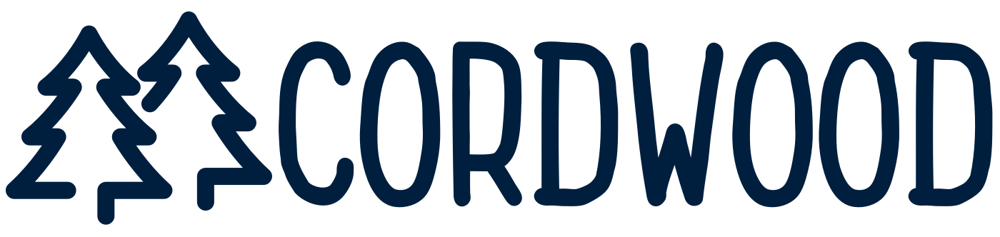

Cordwood allows you to push updates to your Cordova app without having to create a new iOS or Android build. It supports two modes:

- Auto Update (default): *this mode pulls in the latest published version of your app*
- Multiple Versions: *this mode allows the user to pick which version they would like to use*


Install Dependencies
--------------
1. Install Cordwood as a dependency: `bower install https://github.com/rangle/cordwood.git`
2. Install the following Cordova plugins:
  + `cordova-plugin-file-transfer`
  + `cordova-plugin-file`


Getting Setup
--------------
The next step is to modify your `index.html` for Cordwood. We start by including `cordwood.js` in our `index.html`

```html
<script type="text/javascript" src="bower_components/cordwood/dist/cordwood.js"></script>
```

Remove all your all other script tags except `cordova.js` and any 3rd party scripts that you load dynamically. Also, remove all CSS includes and the `ng-app` attribute. The content inside `body` remains the same as before.

Your `index.html` now should look something like this:

```html
<!DOCTYPE html>
<html>
<head>
  <meta charset="utf-8">
  <meta name="viewport"
    content="initial-scale=1, maximum-scale=1, user-scalable=no, width=device-width">
  <title>My App with Cordwood</title>
</head>
<body>
  <ion-nav-view></ion-nav-view>

  <script type="text/javascript" src="lib/cordwood/dist/cordwood.js"></script>
  <script src="cordova.js"></script>
  <script src="https://maps.googleapis.com/maps/api/js?key=my_API_Key_Goes_Here&sensor=true"></script>
</body>
</html>
```

Lastly we need at a script tag with the bootstrap code for Cordwood:

```html
<script>
  function successCallback() {
    angular.element(document).ready(function () {
      angular.bootstrap(document, ['myAppWithCordwood']);
    });
  };

  function errorCallback() {
    window.location = 'error.html';
  };

  document.addEventListener('deviceready', function () {
    Cordwood({
      baseUrl: 'http://my-app-domain.com',
      currentVersion: '0',
      successCallback: successCallback,
      errorCallback: errorCallback,
      multipleVersions: true,
      assetDirectories: ['www/img', 'www/fonts', 'www/lib'],
      cssDirectory: 'www/css'
    });
  }, false);
</script>
```


Usage
-----------------
You can initialize Cordwood with the following options:

- baseUrl: *the base url for your build server*
- currentVersion: *the version of your app that is being shipped on the phone*
- successCallback: *success callback which bootstraps your angular app*
- errorCallback
- multipleVersions: *enable/disable multiple version mode*
- assetDirectories: *a list of your static asset directories*
- cssDirectory: *the app CSS directory*


Releasing a Build
-----------------
In order to use Cordwood you need to have a build server that serves the following:

- JS bundle: *all the app JS packaged into one file &mdash; including 3rd party libraries such as AngularJS or Ionic.*
- CSS bundle: *all the app CSS packaged into one file.*
- version.json: *provides us with the latest version number for the app. This allows Cordwood to figure out if it needs to refresh or not. This end-point is used in the Auto Update mode.*
- versions.json: *provides a list of all available versions, the PR they are associated with and the end point to fetch static assets for each one. This end-point is used in the Multiple Versions mode.*

The bundles can be generated using Gulp. See the example project for more info.


FAQ
-----------------

**Q: Why does the `cordova-plugin-file-transfer` & `cordova-plugin-file` install fail?**

A: You are probably on an older version of Cordova. The naming scheme for pluigns changed recently. Update Cordova or use the old naming scheme for these plugins. The plugins have changed their IDs from `org.apache.cordova.*` to `cordova-plugin-*`.
